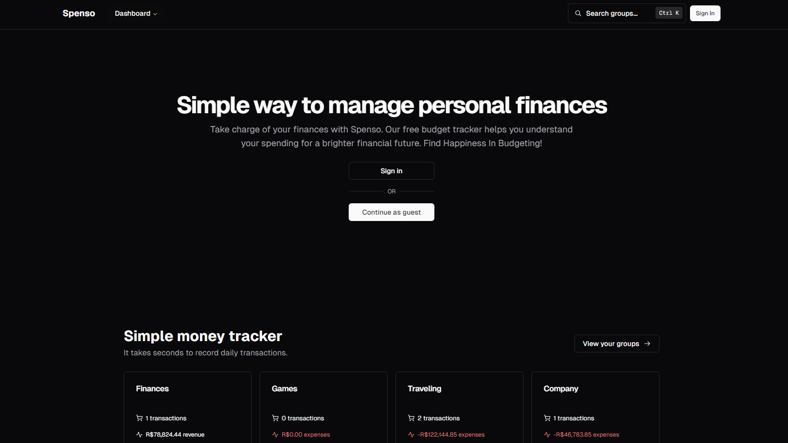

# [Spenso](https://spenso.vercel.app)

Finance web application to track your spending and savings.
Bootstrapped with [`create-next-app`](https://github.com/vercel/next.js/tree/canary/packages/create-next-app).

[](https://spenso.vercel.app)

## Tech Stack

- **Framework:** [Next.js](https://nextjs.org)
- **Styling:** [Tailwind CSS](https://tailwindcss.com)
- **Database:** [Supabase](https://supabase.com)
- **Table:** [Tanstack React Table](https://tanstack.com/table/v8)
- **Form:** [React Hook Form](https://react-hook-form.com)
- **Charts:** [React Chartjs 2](https://react-chartjs-2.js.org)
- **Toaster:** [Toaster](https://sonner.emilkowal.ski)
- **Component Library:** [Radix UI](https://www.radix-ui.com) + [Shadcn UI](https://ui.shadcn.com)

## Features

- Sign in and Log out.
- Create, Read, Update and Delete transactions.
- Save transactions in a database.
- Analyze dashboard charts.

## Running Locally

1. Clone the repository:

   ```bash
   git clone https://github.com/RenanSui/spenso.git
   ```

2. Install dependencies using pnpm:

   ```bash
   pnpm install
   ```

3. Copy the `.env.example` to `.env.local` and update the variables.

   ```bash
   cp .env.example .env.local
   ```

4. Start the development server:

   ```bash
   pnpm run dev
   ```

## How do I deploy this?

Follow the deployment guides for [Vercel](https://create.t3.gg/en/deployment/vercel), [Netlify](https://create.t3.gg/en/deployment/netlify) and [Docker](https://create.t3.gg/en/deployment/docker) for more information.

## License

Licensed under the MIT License. Check the [LICENSE](./LICENSE) file for details.
